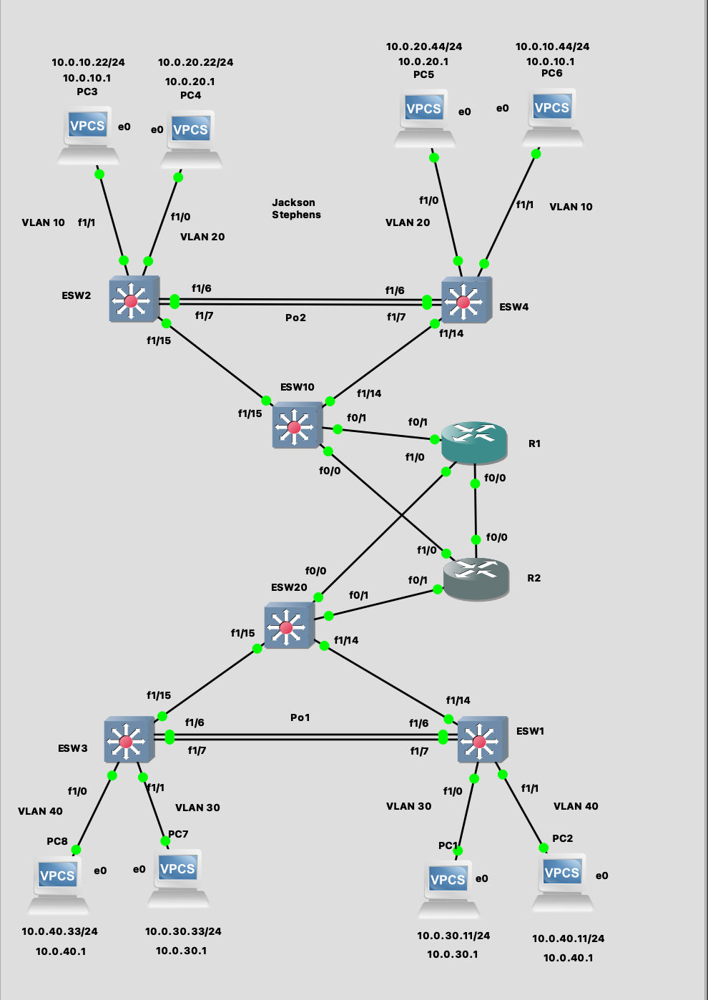
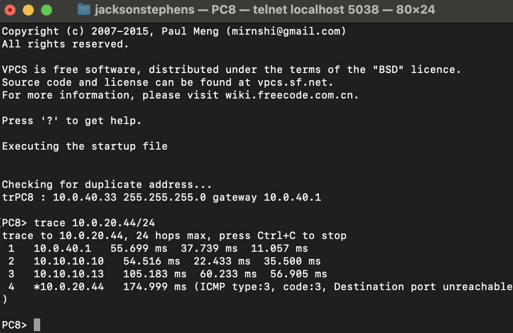
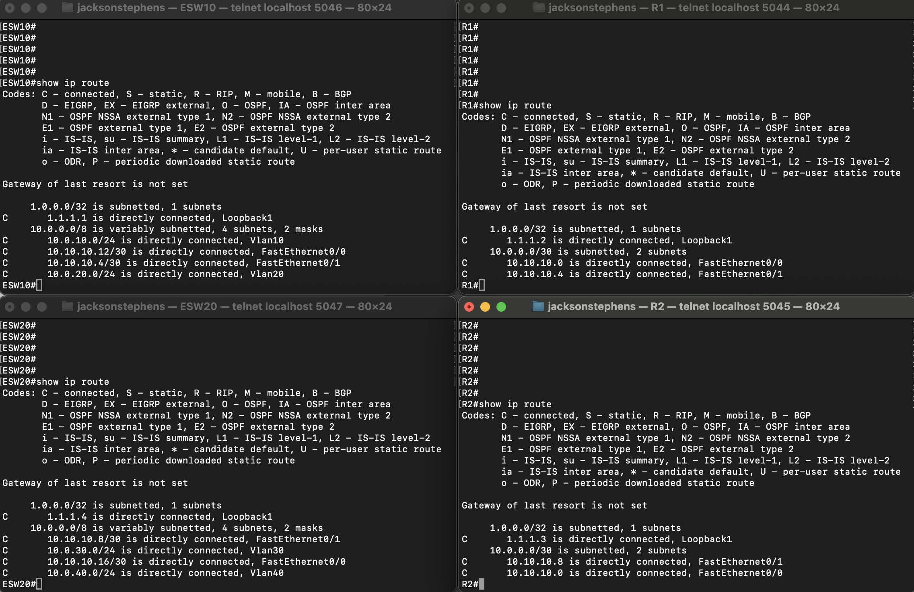
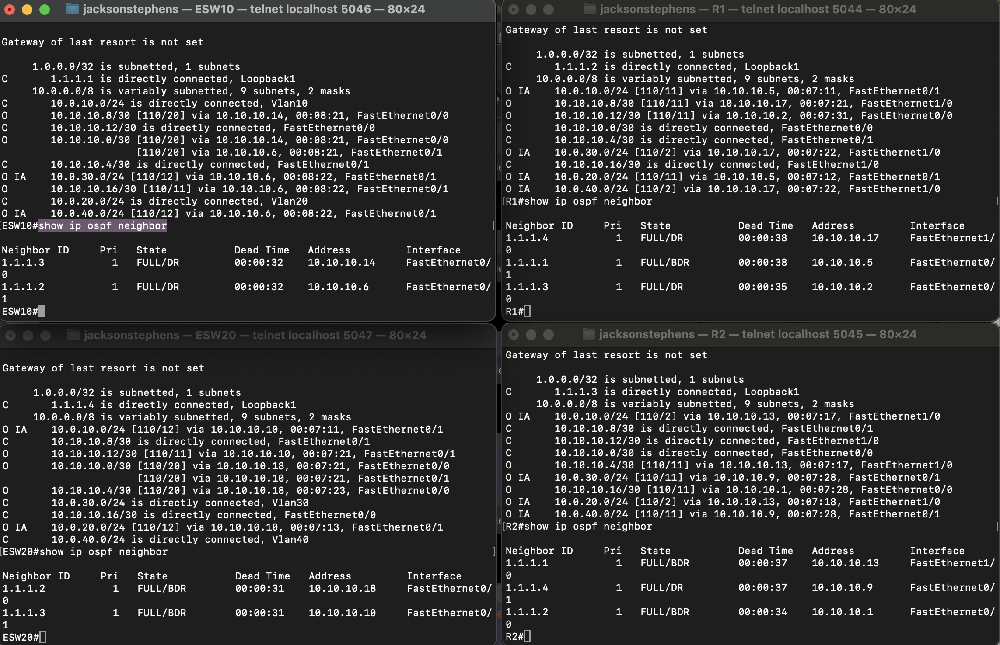
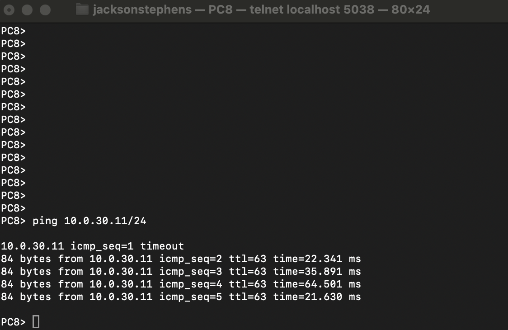
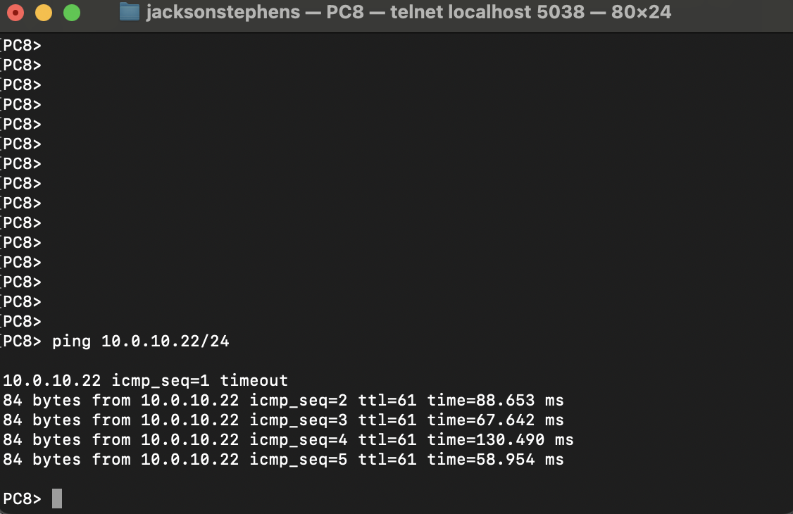
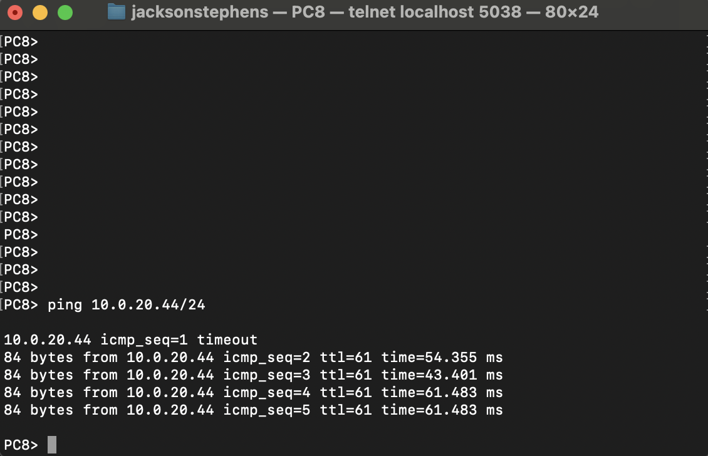

 

Network Topology: 
 

 

Original Trace Route: 
 

 

Removal of Static Routes: 
 

 

Updated Route: 
 

 

Routing Table/ OSPF Neighbors: 
 

 

Ping Testing: 
 

 

Ping Testing: 
 

 

Ping Testing: 
 

 